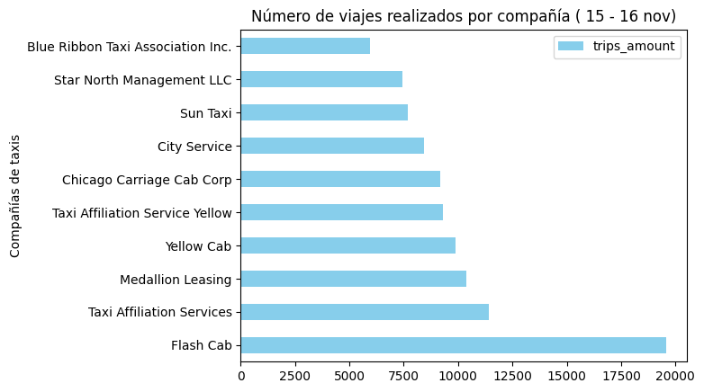
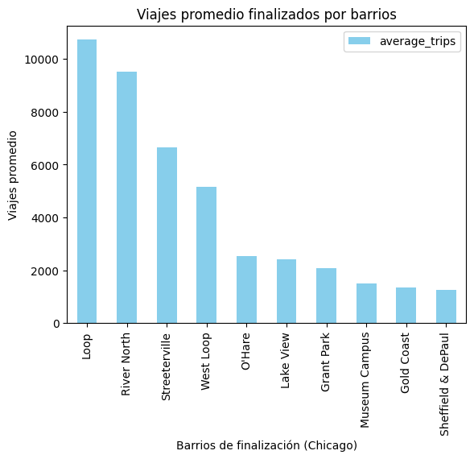

# Impacto del clima en la duración de viajes en taxi (Chicago)

Proyecto de análisis de datos enfocado en comprender cómo factores externos —especialmente el clima— influyen en la duración de los viajes en taxi entre el Loop y el aeropuerto O'Hare.

---

## Objetivo del proyecto

Analizar datos de viajes y condiciones meteorológicas para identificar patrones de comportamiento de los usuarios y validar la hipótesis:

> *La duración promedio de los viajes desde el Loop hasta el Aeropuerto Internacional O'Hare cambia los sábados lluviosos.*

---

## Tecnologías utilizadas

* Python (Pandas, NumPy, Matplotlib, SciPy)
* SQL (consultas, joins, agrupaciones, CASE)
* Web Scraping (BeautifulSoup)
* Jupyter Notebook
* Git & GitHub

---

## Estructura del repositorio

weather_impact/
src/ → obtención de datos climáticos
sql/ → consultas SQL
data/ → datasets
images/ → visualizaciones
notebooks/ → análisis exploratorio y prueba de hipótesis

---

## Análisis exploratorio de datos

### Empresas de taxi vs número de viajes

**Conclusión:**
La demanda está concentrada en pocas compañías principales, lo que sugiere un mercado dominado por operadores grandes. Esto puede influir en tiempos de espera y disponibilidad de vehículos en horas pico.

---

### Top 10 barrios por número de finalizaciones

**Conclusión:**
Los viajes finalizan principalmente en zonas estratégicas de alto flujo, indicando patrones de movilidad recurrentes. Esta información puede utilizarse para posicionamiento predictivo de conductores.

---

### Distribución de duración de viajes

**Conclusión:**
Bajo condiciones climáticas adversas los viajes presentan mayor dispersión y tienden a durar más tiempo, sugiriendo impacto del tráfico y menor velocidad promedio.

---

## Prueba de hipótesis

**Hipótesis nula (H0):**
La duración promedio de los viajes no cambia en sábados lluviosos.

**Hipótesis alternativa (H1):**
La duración promedio de los viajes sí cambia en sábados lluviosos.

Nivel de significancia: α = 0.05

Resultado:
p-value < 0.05 → se rechaza H0

---

## Interpretación de negocio

Existe evidencia estadística de que la lluvia incrementa la duración de los viajes hacia el aeropuerto.

Esto permite a la empresa:

* Ajustar estimaciones de llegada
* Aplicar precios dinámicos en condiciones climáticas adversas
* Mejorar asignación preventiva de conductores

---

## Aprendizajes

* Integración de datos desde múltiples fuentes (web + base de datos)
* Limpieza y preparación de datos
* Análisis exploratorio orientado a negocio
* Validación de hipótesis con pruebas estadísticas
* Comunicación de resultados mediante visualizaciones

---

## Autor

Ana Bustamante
LinkedIn: https://www.linkedin.com/in/anaebustamante/
GitHub: https://github.com/bteana
